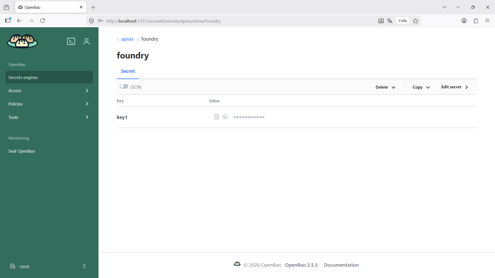
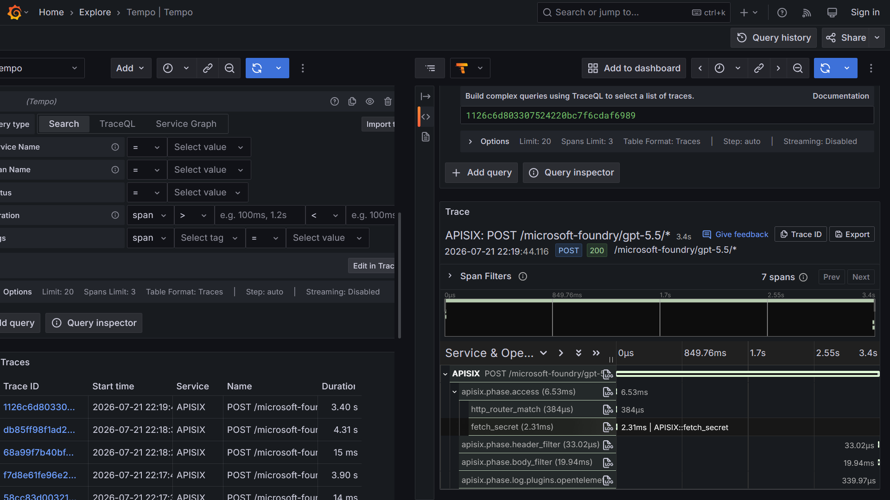
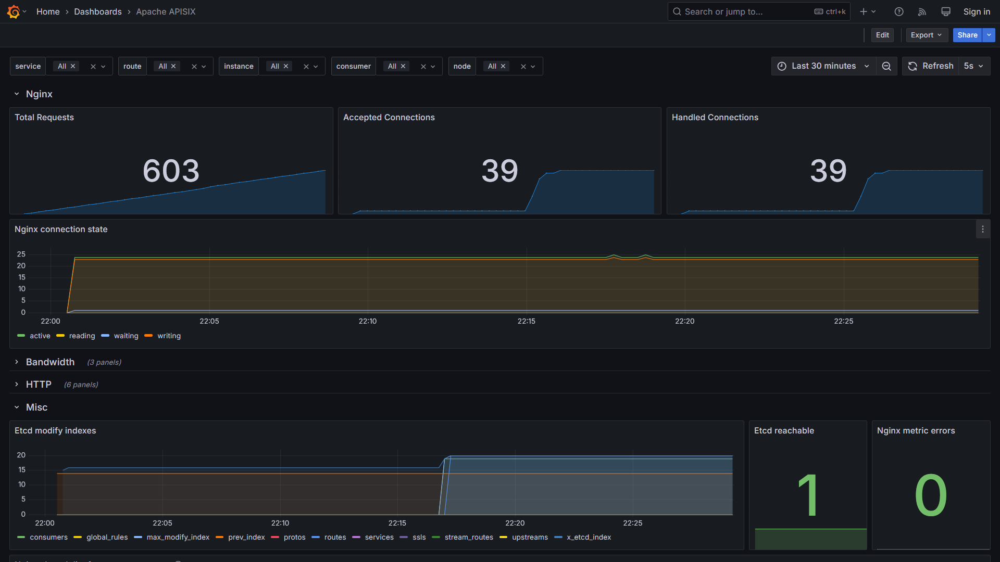

# apisix-ai-gateway-microsoftfoundry-vault-otel-grafana-prometheus-dockercompose
Scripts do Docker Compose para subida de um ambiente do APISIX com capacidade de AI Gateway. Inclui monitoramento com Grafana + OpenTelemetry + Prometheus, com geração de traces de requisições direcionadas ao APISIX e coleta de métricas + secrets (OpenBao/HashiCorp Vault). IA testada: Microsoft Foundry.

## Informações gerais

Utilizando secrets com o **APISIX**:

O **OpenBao** é um projeto open source para gerenciamento de secrets mantido pela **Linux Foundation** e que é um **fork** do **HashiCorp Vault**.

* Site oficial do projeto: **https://openbao.org/**
* GitHub: **https://github.com/openbao/openbao**
* Docker Image: **https://hub.docker.com/r/openbao/openbao**
* OpenBao UI: **https://openbao.org/docs/configuration/ui/**
* KV secrets engine - version 1 (API) - formato de secrets utilizado pelo APISIX: **https://openbao.org/api-docs/secret/kv/kv-v1/**

## Testes

Visualizando Secrets a partir da interface do OpenBao:

Trace gerado durante testes com a rota do ai-proxy (incluindo o acesso ao secret):

Dashboard do Grafana para APISIX:

